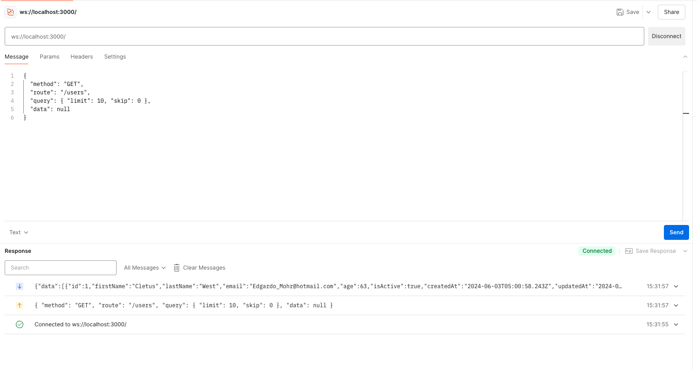

# WebSocket Support in Cambusa

Cambusa provides built-in support for WebSockets, allowing you to easily implement real-time communication in your applications.

## Enabling WebSockets

WebSocket support is enabled by default in Cambusa. To configure WebSocket settings, you can edit the `config/server.js` file.

## WebSocket Configuration

The `config/server.js` file contains the WebSocket configuration. You can configure the WebSocket server settings, such as the port and the path.

```javascript
// config/server.js
export default {
  server: {
  host: '0.0.0.0',
  port: 3000,
  sockets: true, // Enable WebSocket support
};
```

## WebSocket Handler

Cambusa uses a WebSocket handler to manage WebSocket connections and messages.

### Key Components

1. **Connection Handling**: The `open` and `close` methods handle new connections and disconnections.
2. **Message Processing**: The `message` method processes incoming WebSocket messages.
3. **Route Matching**: WebSocket messages are matched to existing HTTP routes, allowing you to reuse your API logic for WebSocket communication.

## Using WebSockets in Your Application

To use WebSockets in your Cambusa application:

1. **Enable WebSocket support** in your server configuration.
2. Send messages from the client **in the following format**:
```json
{
  "method": "GET",
  "route": "/api/messages",
  "data": {
    "message": "Hello, WebSocket!"
  }
}
```
3. Handle WebSocket messages in your existing route handlers. The WebSocket handler will convert the message to an HTTP-like request and execute the corresponding route handler.
4. Send responses back to the client through the WebSocket connection.

;

