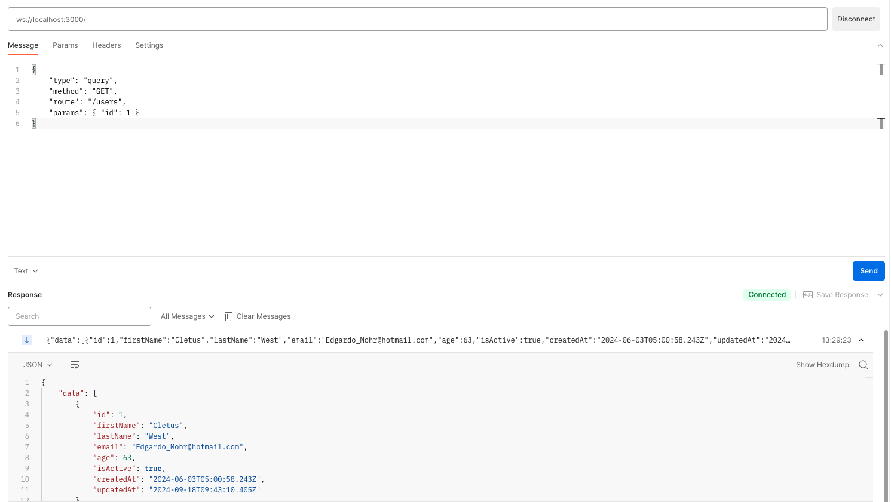

# WebSocket Support in Cambusa

Cambusa provides built-in support for WebSockets, allowing you to easily implement real-time communication in your applications.

## Enabling WebSockets

WebSocket support is enabled by default in Cambusa. To configure WebSocket settings, you can edit the `config/server.js` file.

## WebSocket Configuration

The `config/server.js` file contains the WebSocket configuration. You can configure the WebSocket server settings, such as the port and the path.

```javascript
// config/server.js
export default {
  server: {
  host: '0.0.0.0',
  port: 3000,
  sockets: true, // Enable WebSocket support
};
```

## WebSocket Handler

Cambusa uses a WebSocket handler to manage WebSocket connections and messages.

### Key Components

1. **Connection Handling**: The `open` and `close` methods handle new connections and disconnections.
2. **Message Processing**: The `message` method processes incoming WebSocket messages.
3. **Route Matching**: WebSocket messages are matched to existing HTTP routes, allowing you to reuse your API logic for WebSocket communication.

## Using WebSockets in Your Application

To use WebSockets in your Cambusa application:

1. **Enable WebSocket support** in your server configuration.
2. Send messages from the client **in the following format**:
```javascript
{
  "type": "query",
  "method": "GET",
  "route": "/users",
  "query": { "limit": 10, "offset": 0 }
}
```
3. Handle WebSocket messages in your existing route handlers. The WebSocket handler will convert the message to an HTTP-like request and execute the corresponding route handler.
4. Send responses back to the client through the WebSocket connection.

;

## WebSocket Message Format and Validation

Cambusa uses a specific message format for WebSocket communications and validates incoming messages to ensure they conform to the expected structure. This helps maintain consistency and security in your application's real-time communication.

### Message Structure

WebSocket messages in Cambusa should follow this general structure:

### Field Descriptions

- `type` (required): Specifies the type of message. Common types include "query", "subscribe", and "unsubscribe".
- `method` (optional): For query-type messages, specifies the HTTP method (e.g., "GET", "POST", "PUT", "DELETE").
- `route` (optional): The server route to be called, similar to HTTP endpoints.
- `data` (optional): The payload of the message, typically used for POST or PUT operations.
- `query` (optional): Query string parameters.

### Available Types

- `query`: Send a query to the server.
- `subscribe`: Subscribe to entity updates.
- `unsubscribe`: Unsubscribe from entity updates.

### Subscribing to Entity Updates

Clients can subscribe to entity updates by sending a WebSocket message:

```javascript
{
  "type": "subscribe",
  "model": "User"
}
```

### Unsubscribing from Entity Updates

Clients can unsubscribe from entity updates by sending a WebSocket message:

```javascript
{
  "type": "unsubscribe",
  "model": "User"
}
```

### Receiving Entity Updates

Once subscribed, clients will receive messages for entity updates:

```javascript
{
  "type": "update",
  "model": "User",
  "action": "insert" | "update" | "remove",
  "data": { /* updated entity data */ }
}
```

## WebSocket Message Format and Validation

Cambusa uses a specific message format for WebSocket communications and validates incoming messages to ensure they conform to the expected structure. This helps maintain consistency and security in your application's real-time communication.

### Message Structure

WebSocket messages in Cambusa should follow this general structure:

```javascript
{
  type: String,
  method: String (optional),
  route: String (optional),
  data: Any (optional),
  query: Any (optional)
}
```

### Validation Schema

Cambusa uses the following validation schema for WebSocket messages:

```javascript
body: t.Object({
  type: t.String(),
  method: t.Optional(t.String()),
  route: t.Optional(t.String()),
  data: t.Optional(t.Any()),
  query: t.Optional(t.Any()),
})
```

### Field Descriptions

- `type` (required): Specifies the type of message. Common types include "query", "subscribe", and "unsubscribe".
- `method` (optional): For query-type messages, specifies the HTTP method (e.g., "GET", "POST", "PUT", "DELETE").
- `route` (optional): The server route to be called, similar to HTTP endpoints.
- `data` (optional): The payload of the message, typically used for POST or PUT operations.
- `query` (optional): Query string parameters.

### Examples

1. Querying data:
```javascript
{
  "type": "query",
  "method": "GET",
  "route": "/users",
  "query": { "limit": 10, "offset": 0 }
}
```

2. Subscribing to entity updates:
```javascript
{
  "type": "subscribe",
  "model": "User"
}
```

3. Updating data:
```javascript
{
  "type": "query",
  "method": "PUT",
  "route": "/users/123",
  "data": { "name": "John Doe", "email": "john@example.com" }
}
```

By adhering to this message format and validation schema, you ensure that your WebSocket communications with Cambusa are consistent and properly structured, facilitating smooth real-time interactions in your application.
